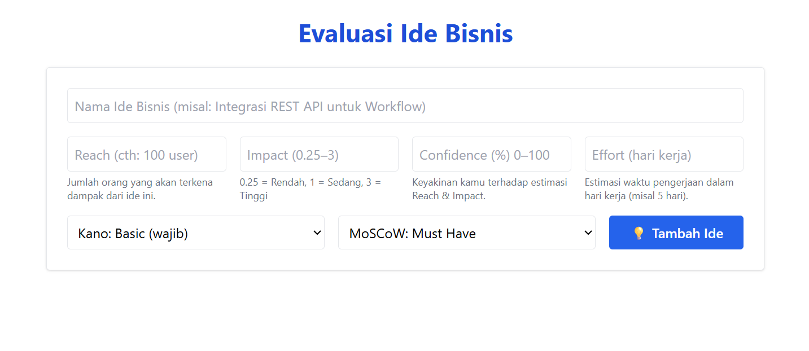

# 💡 Business Idea Evaluator

**Business Idea Evaluator** adalah aplikasi berbasis web yang membantu Anda mengevaluasi dan memprioritaskan ide bisnis menggunakan tiga pendekatan populer:

- ✅ **RICE** (Reach, Impact, Confidence, Effort)
- 📊 **Model Kano**
- 📌 **MoSCoW Prioritization**

---

## ✨ Fitur Utama

- Menambahkan ide bisnis beserta metrik evaluasinya.
- Menghitung skor **RICE** secara otomatis.
- Klasifikasi ide berdasarkan **Model Kano** dan **MoSCoW**.
- Antarmuka sederhana, intuitif, dan responsif.

---

## 🖼️ Tampilan Antarmuka

 <!-- Tambahkan file screenshot jika tersedia -->

---

## 🚀 Teknologi yang Digunakan

- React dengan TypeScript
- Tailwind CSS

---

## 🧑‍💻 Cara Menjalankan di Lokal

```bash
# 1. Clone repositori ini
git clone https://github.com/fahroediin/Business-Idea-Evaluator.git
cd Business-Idea-Evaluator

# 2. Install dependensi
npm install

# 3. Jalankan proyek
npm run dev


Penjelasan Metode Evaluasi
🔢 RICE Score
RICE adalah metode untuk memprioritaskan ide berdasarkan dampak dan usaha yang dibutuhkan.
Rumus:
RICE = (Reach × Impact × Confidence) / Effort
Reach = Seberapa banyak pengguna yang akan terdampak

Impact = Seberapa besar dampaknya (0.25 sampai 3)

Confidence = Seberapa yakin estimasi ini (0 sampai 100)

Effort = Waktu pengerjaan dalam hari kerja

🎯 Model Kano
Kategorisasi fitur/ide berdasarkan pengaruhnya terhadap kepuasan pengguna:

Basic: Harus ada, jika tidak maka pengguna tidak puas

Performance: Semakin banyak, semakin baik

Excitement: Fitur tambahan yang memberi kesan "wow"

⚖️ MoSCoW Method
Metode untuk menentukan prioritas:

Must Have: Wajib ada

Should Have: Sangat disarankan

Could Have: Opsi tambahan jika memungkinkan

Won’t Have: Tidak diperlukan saat ini

✅ Contoh Data
Nama Ide	                         RICE Score	 Kano	         MoSCoW
Integrasi REST API untuk Workflow	 125.00	     Performance	 Must Have

📄 Lisensi
Proyek ini menggunakan lisensi MIT.

🙌 Kontribusi
Kontribusi sangat terbuka! Silakan fork repositori ini, buat perubahan, dan kirimkan pull request. Saran dan masukan juga sangat diterima melalui Issues.

📫 Kontak
Dibuat oleh Fahroediin
Jika Anda memiliki pertanyaan atau saran, silakan hubungi melalui GitHub atau buka issue di repositori ini.
